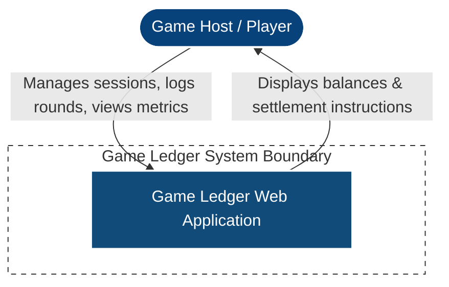
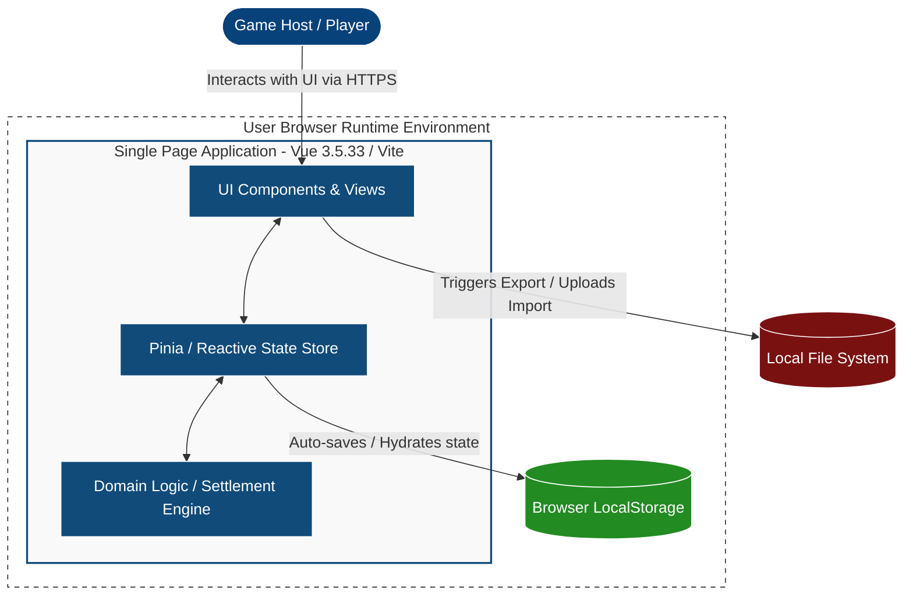

# TECHNICAL SPECIFICATION: GAME LEDGER (TECH.SPEC.MD)

## 1. TECHNOLOGY STACK & DEPLOYMENT ARCHITECTURE

### 1.1 Core Stack
- **Build Tool & Bundler:** Vite (for fast, optimized build pipelining)
- **Frontend Framework:** Vue 3.5.33 (Strictly locked to this stable release, leveraging the Composition API)
- **Styling Framework:** Tailwind CSS (utility-first CSS engine for responsive design)

### 1.2 Deployment & Hosting
- **Architecture:** 100% Client-Side Static Site (SPA).
- **Hosting Provider:** GitHub Pages.
- **Build Workflow:** Static Site Generation (SSG/Static compilation). Compilation outputs a directory of static assets (`dist/`) requiring zero server-side compute.

---

## 2. ARCHITECTURAL BLUEPRINT (C4 MODEL)

### 2.1 Level 1: System Context Diagram
The overall relationship between the user, the core boundary of the application, and the client-side system.

### 2.2 Level 2: Container Diagram
A detailed breakdown of the internal client-side subsystems executing inside the user's web browser environment.

---

## 3. TECHNICAL CONSTRAINTS & DEVELOPMENT RULES

### 3.1 Identifiers & Data Integrity
- **Unique IDs:** Strict enforcement of RFC4122 **UUID v4** for all entities (`players`, `gameTypes`, `gameSessions`, `refunds`). Client-side generation must use native web APIs (`crypto.randomUUID()`).
- **Relational Constraints:** Entity cascades are prohibited. Deleting a `player` or `gameType` that is referenced by an existing `gameSession` or `refund` object must be hard-blocked by code logic.

### 3.2 Calculations & Floating-Point Precision
- **Precision Lock:** All monetary computations, balances, and allocations must be processed to **exactly 2 decimal places**.
- **Float Protection:** Prevent standard JavaScript binary floating-point errors (e.g., 0.1 + 0.2 = 0.30000000000000004) by using scaling integer patterns internally (cents math) or strict rounding methods (`Math.round()` or processing numbers via safe decimal util libraries before saving updates).

### 3.3 UI/UX Design Token Specifications
- **Responsive Adaptability:**
  - *Viewport < 768px (Mobile):* Optimized single-column view layout. Action components (game entry, round winner clicking) feature maximized touch targets (> 44px). 
  - *Viewport >= 768px (Desktop):* Multi-column grid layout displaying granular analytical tabular data dashboards and administrative configuration panels side by side.
- **Semantic Binary Color-Coding:** 
  - Financial credits, positive net performance values, and incoming cash flows must explicitly map to semantic green variants (`text-green-600` / `bg-green-100`).
  - Financial debts, negative net margins, and outgoing cash flows must explicitly map to semantic red variants (`text-red-600` / `bg-red-100`).

---

## 4. QUALITY ASSURANCE & TDD STRATEGY

### 4.1 Test-Driven Development Mandate
All core business calculations, state mutation flows, and functional state machines must be built following strict Test-Driven Development methodologies prior to component scaffolding.

### 4.2 Core Targets for Test Isolation
- **Domain Settlement Engine:** Verification of the *Min-Max Cash Flow* reduction matrices.
- **Round Calculation Pipelines:** Validation of the (Y - 1) * X distribution rules.
- **State Serialization Transformers:** Validation of corrupted JSON parsing failures and schema structures during storage migrations or import actions.